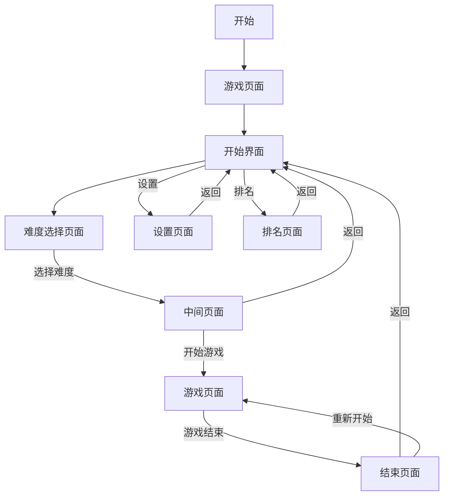
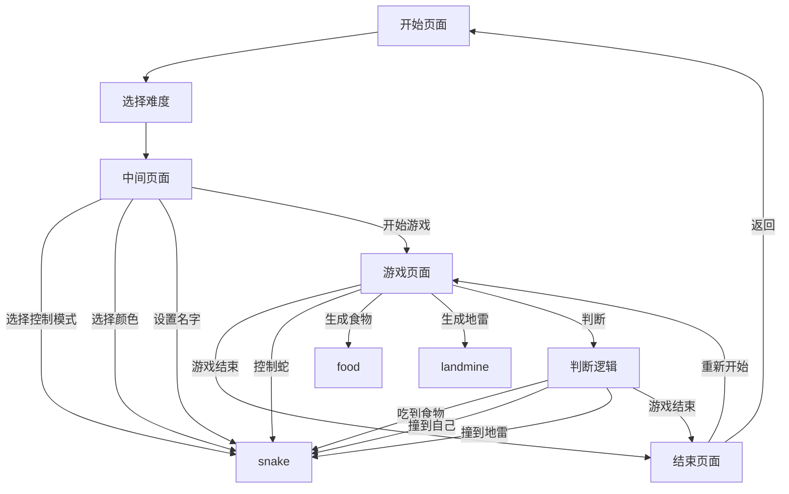
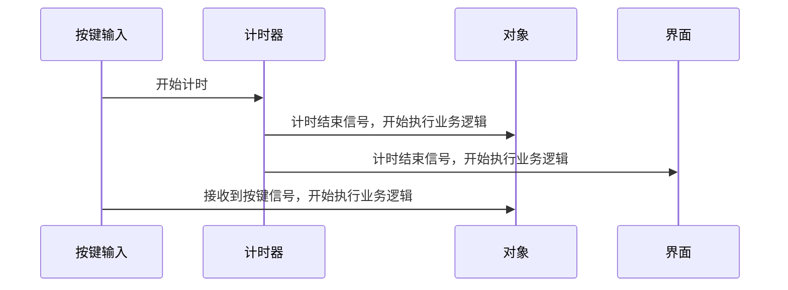
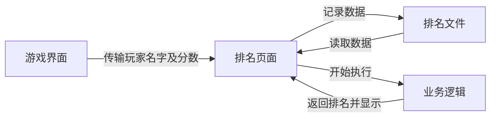

```mermaid
graph TB
A[开始]-->B[游戏页面]
B-->C[开始界面]
C-->D[难度选择页面]
D-->|选择难度| E[中间页面]
E-->|返回| C[开始界面]
E-->|开始游戏|F[游戏页面]
F-->|游戏结束| G[结束页面]
G-->|返回| C[开始界面]
G-->|重新开始| F[游戏页面]
C-->|设置| H[设置页面]
C-->|排名| I[排名页面]
H-->|返回| C[开始界面]
I-->|返回| C[开始界面]
``` 

```mermaid
graph TB

startPage[开始]-->DifficultyPage[选择难度]
DifficultyPage-->middlePage[中间页面]
middlePage-->|选择控制模式|snake[snake]
middlePage-->|选择颜色|snake[snake]
middlePage-->|设置名字|snake[snake]
middlePage-->|开始游戏|gamePage[游戏页面]
gamePage-->|游戏结束|gameOverPage[结束页面]
gamePage-->|控制蛇|snake[snake]
gamePage-->|生成食物|food[food]
gamePage-->|生成地雷|landmine[landmine]
gameOverPage-->|返回|startPage[开始页面]
gameOverPage-->|重新开始|gamePage[游戏页面]
gamePage-->|判断|judge[判断逻辑]
judge-->|吃到食物|snake[snake]
judge-->|撞到自己|snake[snake]
judge-->|撞到地雷|snake[snake]
judge-->|游戏结束|gameOverPage[结束页面]

```

```mermaid
sequenceDiagram
    participant 按键输入
    participant 计时器
    participant 对象
    participant 界面
    按键输入 ->> 计时器: 开始计时
    计时器 ->> 对象: 计时结束信号，开始执行业务逻辑
    计时器 ->> 界面: 计时结束信号，开始执行业务逻辑
    按键输入 ->> 对象: 接收到按键信号，开始执行业务逻辑

```

```mermaid
graph LR
gamePage[游戏界面] -->|传输玩家名字及分数|rankingPage[排名页面]
rankingPage -->|记录数据|rankingtxt[排名文件]
rankingtxt -->|读取数据|rankingPage
rankingPage -->|开始执行|judge[业务逻辑]
judge -->|返回排名并显示|rankingPage
```

